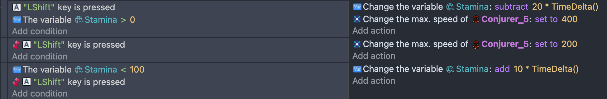
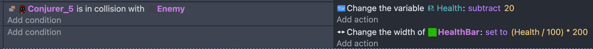
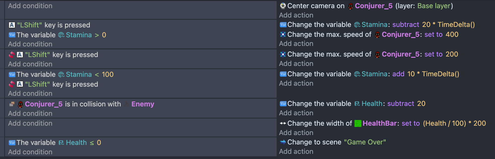
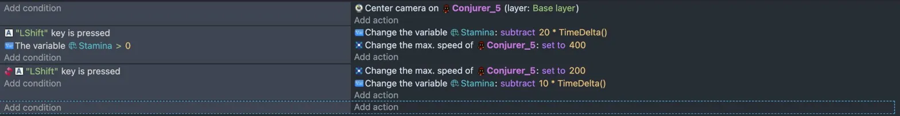
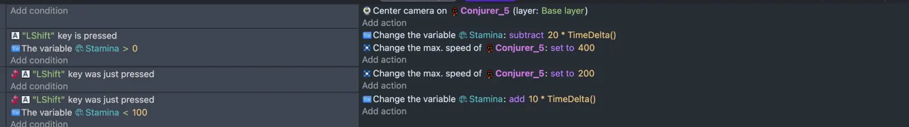

# Entry 4
##### 2/10/26
### Content
In this Blog entry, our teacher told us to work on our games. He had us create an MVP plan to help us focus on what to build first. For my game I worked on the player mechanics which included movement, a camera system, stamina bar, and a health system.For stamina bar, I make it where LShift increases speed and drains stamina which recharges when released. I also built a health system where colliding with an enemy will health and then triggers a Game Over screen when it hits zero. Also I work on the map which is still working progess.
  
-make the camera focus on the player.
 
- make it when you don't sprint, it don't decrease, but it will if you sprint.
 
- visual health bar that scales with the player's health.

Full Code:
 
### Challenge
Most Challenege I had faced was sprint bar because It wouldn't sprint which I figure out that you need make it seperate event for it in order work.
Before 

After 

### EDP
Currently, I am at the testing and prototyping stage of the engineering design process. I have moved further into that stage by building out more of my game mechanics. I implemented sprint with a stamina system, a health bar, and a Game Over screen. I am still prototyping and testing as my map is also a work in progress.
### Skill
#### Problem Solving
I showed problem solving when fixing my sprint mechanic. I figured out the correct inverted condition for stamina recharging and worked out the right formula to make the health bar shrink properly.

#### Creativity
I showed creativity by designing a stamina system that drains while sprinting and recharges when you stop, and a health system that triggers a Game Over screen when the player runs out of health.

[Previous](entry03.md) | [Next](entry05.md)

[Home](../README.md)
