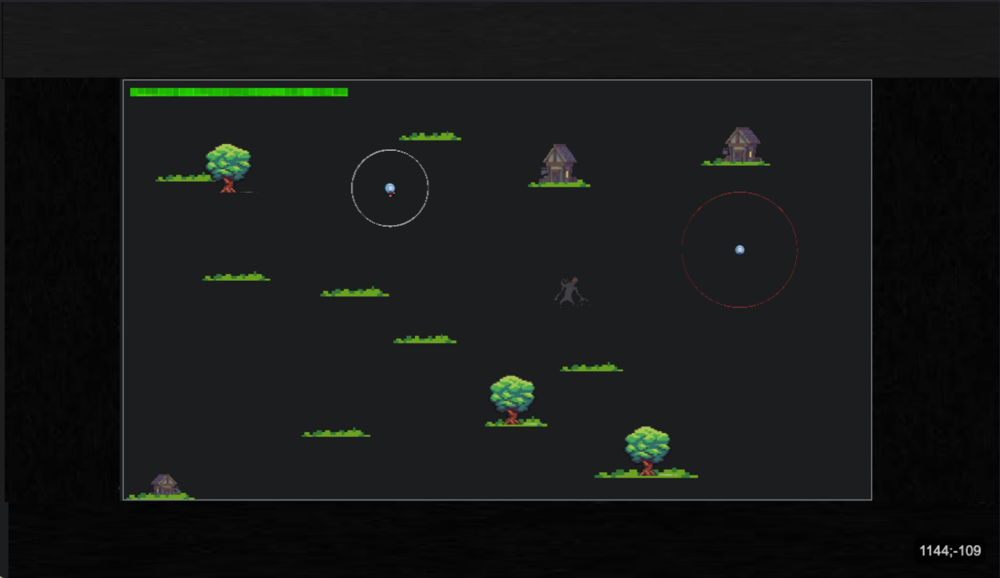
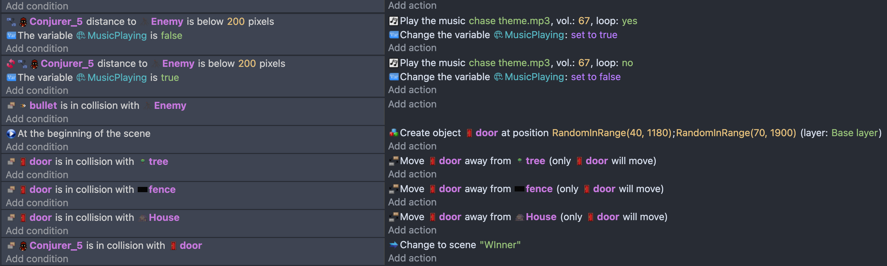
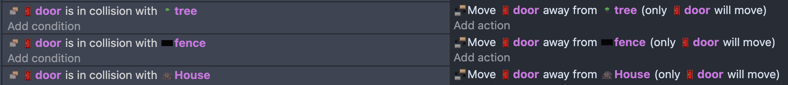

# Entry 5
##### 4/12/26
### Content
In this Blog entry, I finish my game using my MVP. I built out the full map with layout,obstacles, and lighting. Enemy AI is finally done with follow behavior and pathfinding. Main objective is complete with the win condition and start/restart screen. 

Map:
 
New Code:
 
### Source 
* [Learning Log](https://github.com/derrickc1170/sep11-freedom-project/blob/main/tool/learning-log.md)
* [PathFinding](https://www.youtube.com/watch?v=0aGBYsrGwm0)
* [My Game](https://gd.games/games/72bcac7d-88c9-43ec-a761-c179c0c3e44d)
* [Plan](https://github.com/derrickc1170/sep11-freedom-project/blob/main/prep/plan.md)

### Challenge 
The Challenge I faced during making my game was that you can pass through the object. So I solve it by using this collison to make it pass through.

After Code:
 

### EDP
Currently, I completed the testing and prototyping stage of the engineering design process. I finished mvp which building out all of my game mechanics, including a sprint system with stamina management, a health bar, and a Game Over screen. My map design is also fully complete. My next step to go beyond mvp.
### Skill
#### Problem Solving
I showed problem solving by troubleshooting my map, enemy AI, and game mechanics, adjusting my code until everything worked correctly.
#### Creativity
I showed creativity by designing a horror-themed game with a full map, enemy AI, sprint and stamina system, health bar, and a complete objective system.

[Previous](entry04.md) | [Next](entry06.md)

[Home](../README.md)
