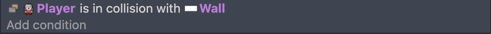
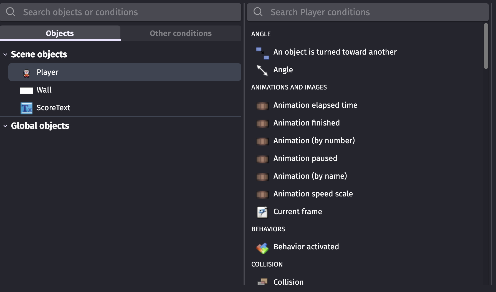
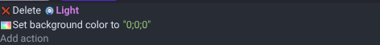
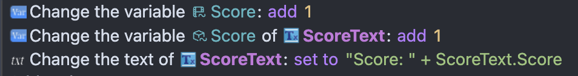
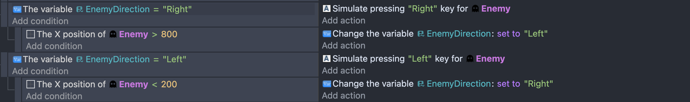
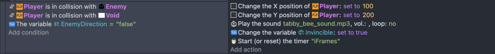
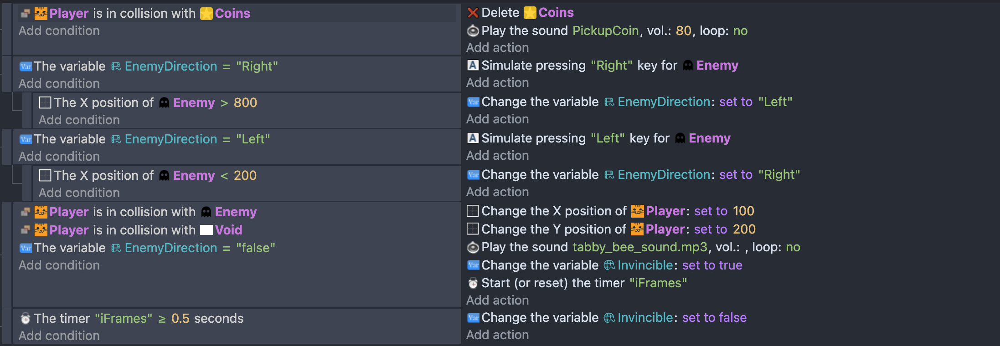
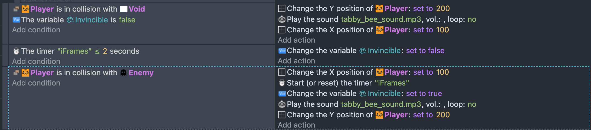

# Tool Learning Log

## Tool: **gdevelop.io**

## Project: **Psychological Horror Game**

---

### 10/2/25

#### Progress
I watched this video to understand GDevelop:  
[Beginner’s Guide To GDevelop](https://www.youtube.com/watch?v=595-swNh0Mw)

- I added a **player character object** to my project.  
- I added a **Top-down movement behavior** to the player so it can move around with arrow keys or WASD.  
    
- I created **wall objects** to act as boundaries.  
- I learned how to **add a collision event** so the player cannot go through walls.  
    
- I used **“Collision → Player collides with Wall”**.  
- I set the action to *move the player back or stop movement* to prevent passing through walls.  
    

#### Challenges
- The menu in GDevelop was **confusing at first**, making it hard to find the correct actions and options, like **adding to a variable** or updating the **Text object**.  
    

#### Next Steps
- Next time, I would try to **add lighting effects** to the game to create a more horror/atmospheric feeling.  

---

#### Project Link
[Open in GDevelop](https://gd.games/games/c4420efc-73d8-42c7-b584-fc75c2c6dd8d)

### 11/1/25:
#### Progress

I watched this video to learn how to create lighting effects in GDevelop:
[How To Use The Light Object](https://www.youtube.com/watch?v=NaeOsm1TKiM&utm_source=chatgpt.com)

-  I added a player character object to test lighting.
-  I experimented with a light source that makes the screen turn dark when the player gets near it.

 

-  I learned how to use Lighting layers and Light objects to create a simple effect.

#### Challenges

-  Figuring out how to trigger the darkness based on player position.
 

#### Next Steps

- Next, I want to add a score in my respwan game to make it more fun.
[Open in GDevelop](https://gd.games/games/27ac6c1f-c5e1-41a3-aa25-bd1235d68bd7)
### 11/12/25

#### Adding Score
I watch this video to lean how to add score to game in GDevelop:
[Adding Coins](https://www.youtube.com/watch?v=DfSVeKkNm_o)
- I added a score variable and a score text object to display it on the screen.

- Next, I added events that increase the score when the player collides with a specific object (like a wall or collectible).

#### Challenges

- At first, the score didn’t update correctly and that it wouldn't work. After watching the video, I realized I needed to convert the variable to a string when updating the text object for it to work.
#### Next Step
- Add more interactive objects that increase the score by lot  when the player interacts with them.
- Introduce a gun obstacle that the player must avoid which  if the player is hit, they lose points.
[Open in GDevelop](https://gd.games/games/c4420efc-73d8-42c7-b584-fc75c2c6dd8d)
### 11/20/25:
I just add more stuff to my game where I make object where you touch it it lose point.
[Video](https://www.youtube.com/watch?v=r_Z8N9asT14)
- I used a timer to control when bombs appear.Then I started (or reset) a timer called "BadItemSpawnTimer".
- When this timer reaches the certain time , the game creates a new bomb. I spawned the Bomb at a random position.
- I used RandomInRange(0, SceneWindowWidth()) and RandomInRange(0, SceneWindowHeight()) that allow the Bomb appears anywhere on the screen. After it spawning a bomb, Code will reset the timer again.
- This makes the bombs spawn over and over. When the player touches the Bomb, the Bomb gets deleted which allow to  keeps the screen clean,so Bombs don’t pile up.
-Also I changed the score when a Bomb is touched.
-It subtracted 10 from the score variable. It will updated my score text.
- I changed the ScoreText object to display: "Score: " + ToString(Score) to get my result.
### 1/3/25:
I watch video based on ai pathfinding since I need this on my horror game.
[Video](https://www.youtube.com/watch?v=0aGBYsrGwm0)
- I create a new game which it is pathformer game
- I add enemy variable which make them move left and right.

- I make the player, so when they touch the enemy or void then they will teleport back to respawn point.

- so my entire code is look like this

#### Challenge 

I want player to be teleport back to spawn point but player went through the void, so I had to seperate the player with colission with void and enemy.
It should look like this.

#### Next Goal 
I going try learn how to make a game 3D.

<!--
* Links you used today (websites, videos, etc)
* Things you tried, progress you made, etc
* Challenges, a-ha moments, etc
* Questions you still have
* What you're going to try next
-->
