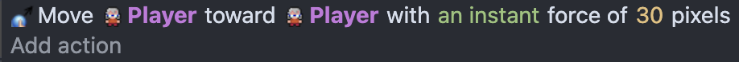
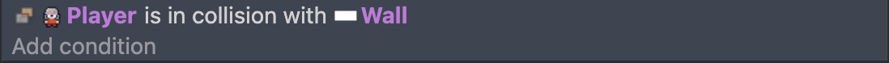
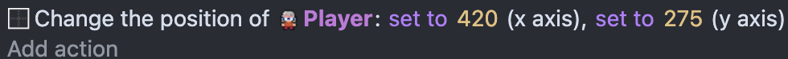
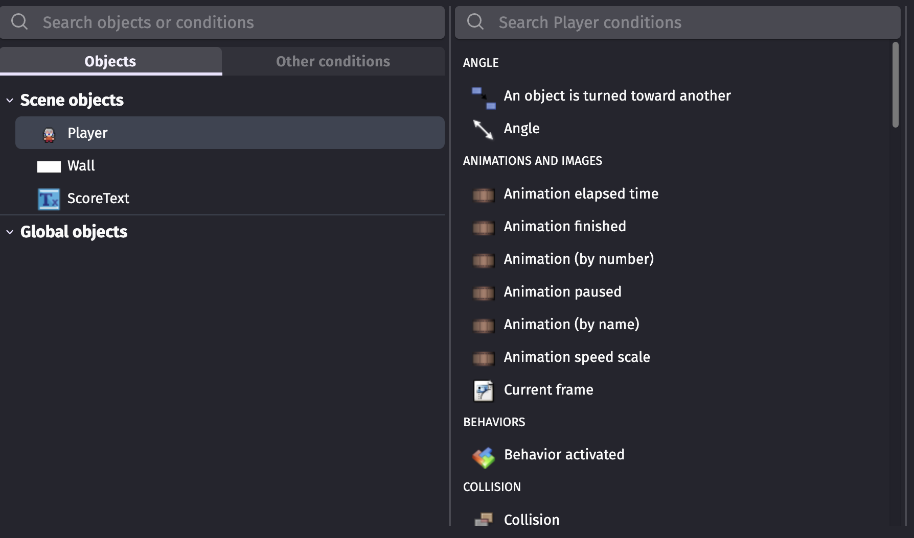

# Tool Learning Log

## Tool: **gdevelop.io**

## Project: **Psychological Horror Game**

---

### 10/2/25

#### Progress
I watched this video to understand GDevelop:  
[Beginner’s Guide To GDevelop](https://www.youtube.com/watch?v=595-swNh0Mw)

- I added a **player character object** to my project.  
- I added a **Top-down movement behavior** to the player so it can move around with arrow keys or WASD.  
    
- I created **wall objects** to act as boundaries.  
- I learned how to **add a collision event** so the player cannot go through walls.  
    
- I used **“Collision → Player collides with Wall”**.  
- I set the action to *move the player back or stop movement* to prevent passing through walls.  
    

#### Challenges
- The menu in GDevelop was **confusing at first**, making it hard to find the correct actions and options, like **adding to a variable** or updating the **Text object**.  
    

#### Next Steps
- Next time, I would try to **add lighting effects** to the game to create a more horror/atmospheric feeling.  

---

#### Project Link
[Open in GDevelop](https://gd.games/games/c4420efc-73d8-42c7-b584-fc75c2c6dd8d)

### X/X/XX:
* Text

<!--
* Links you used today (websites, videos, etc)
* Things you tried, progress you made, etc
* Challenges, a-ha moments, etc
* Questions you still have
* What you're going to try next
-->
